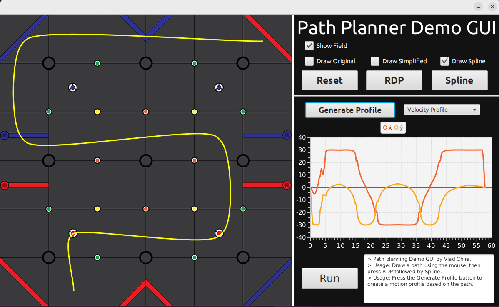

# A Java port of a simple motion planning library for wheeled mobile robots

Please view the original Python library that I made [here](https://github.com/VladChira/pypathplanner).   

This port is made so that the library can be used on FTC robots using Java. It is not up to date with the Python library, and it is incomplete either way.

 Screenshot from the GUI demo app
